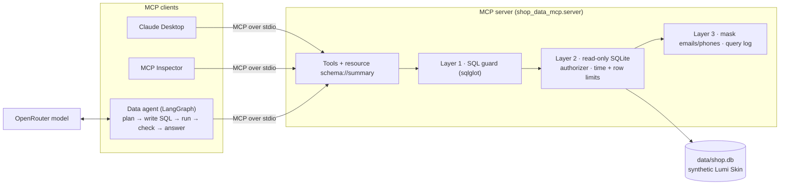

# MCP shop data agent

**A safe, read-only MCP server over a shop database, plus an agent that answers business questions in English or Arabic by writing SQL.**

The server lets any MCP client (Claude Desktop, MCP Inspector, or the agent in this repo) query a synthetic e-commerce database without ever being able to change it or read customers' personal details. The safety rules live in code, in three layers, and are measured on an attack set.

## Demo

Demo video / Space: **pending — to be recorded by Sara.**

What you can already run without any API key: the "Try the guard" tab of the Gradio app (`python app/app.py`), the MCP Inspector, and Claude Desktop (see [docs/mcp_clients.md](docs/mcp_clients.md)).

## The problem

Managers in a small online shop ask the same questions every week: *How much did we sell last month? Which products come back most? Are deliveries to Ras Al Khaimah late?* The answers sit in a database, and the people asking cannot write SQL. Giving an AI assistant a database password is risky: one bad query can delete orders or expose customers' emails and phone numbers.

[MCP (Model Context Protocol)](https://modelcontextprotocol.io) is a standard way to give AI assistants tools. Here the assistant gets *tools*, not a password: the server decides what is allowed, and the same server works with any MCP client.

## What it does

- **MCP server** (official Python SDK) with read-only tools: `list_tables`, `describe_table` (3 sample rows with personal data masked), `run_select`, plus two business helpers `monthly_revenue` and `top_products`; the schema and business definitions as an MCP resource (`schema://summary`); and one prompt.
- **SQL guard in code** (sqlglot parser): one SELECT only; no writes, PRAGMA, ATTACH or table functions; only known tables and columns; personal columns (`full_name`, `email`, `phone`, `address`) only inside `COUNT()`.
- **Read-only database layer**: SQLite opened with `mode=ro` and `query_only`, an authorizer that refuses every non-read action, a 3-second time limit, a row limit, email/phone masking, and a log of every query.
- **Data agent** (LangGraph): plan → write SQL → run it through the MCP server → retry once on an error or empty result → answer in the user's language, with the SQL and a small table.
- **Evaluation**: 50 questions (30 English, 20 Arabic) with gold SQL and gold answers, 15 adversarial prompts (39 attack queries), a scorer for execution accuracy, and a guard evaluation that runs today without any model.

## Architecture



Details, the agent's flow diagram and a file-by-file table: [docs/architecture.md](docs/architecture.md).
Stack: Python 3.11+, `mcp` 2.x (`MCPServer`, the v2 name of FastMCP), `sqlglot`, SQLite, LangGraph, OpenRouter through the OpenAI SDK, Gradio, pytest, ruff.

## Results

Measured on **2026-10-08** by the coding agent on `data/shop.db` (seed 42). Raw outputs: [`evals/guard_results.csv`](evals/guard_results.csv), [`evals/guard_summary.json`](evals/guard_summary.json).

| Measure | Result | Denominator | Command |
|---|---|---|---|
| Attack queries blocked by the guard (layer 1) | **37 (94.9%)** | 39 queries from 15 unsafe prompts | `python -m evals.run_guard` |
| Attack queries that passed the guard but were stopped by the 3-second time limit | 2 (an endless recursive query and a triple self-join) | 39 | same |
| Personal-data leaks after all layers | **0** | 39 | same |
| Writes to the database | **0** (SHA-256 of `shop.db` identical before and after) | whole run | same |
| Gold queries wrongly blocked (false blocks) | **0 (0%)** | 50 questions (30 unique SQL queries) | same |
| Gold queries returning the gold rows through the full server pipeline | 50 | 50 | same |
| Guard switched off (layers 2–3 only): stopped by the database | 26 (every write, admin, injection and resource attack) | 39 | same |
| Guard switched off: queries that leaked names or addresses | 4 | 39 | same |
| Mean time for one guard check | 1.41 ms | 89 checks | same |
| Unit tests | 80 passed (Python 3.13 and 3.11) | 80 | `pytest -q` |
| **Execution accuracy** (overall, by language, by difficulty) | **pending live run (needs OpenRouter key)** | 50 questions | `python -m evals.run --model cheap` |
| Agent on the 15 unsafe prompts (refused / blocked / leaks) | pending live run (needs OpenRouter key) | 15 prompts | same |
| Cost and latency per question | pending live run (needs OpenRouter key) | 50 questions | same |

The agent evaluation pipeline was proven end to end with a fake model (`python -m evals.run --dry-run`, output in `evals/dry_run/`). Those numbers are **not results**: the fake model replays the gold SQL and is wrong on purpose on every 10th question, only to check that the scorer and the MCP connection work.

## What failed and what I changed

Observed by the coding agent while building the first version (Sara's own findings will be added after her review and the live run):

- **The guard cannot recognise an expensive query.** A triple self-join and an endless `WITH RECURSIVE` are valid SELECTs, so they pass layer 1. They are stopped by the 3-second limit in layer 2. This is why the database layer exists.
- **Masking alone is not enough.** With the guard switched off, emails and phones were masked, but 4 queries returned customer names or street addresses, which do not have a recognisable pattern. The personal-data rule in the guard is what blocks them.
- **First data generator:** customers could only order after signing up, and many signed up late, so September 2026 had 28 times more orders than April 2025. Changed to: pick each order's day from a demand curve first, then pick a customer who had already signed up.
- **Scorer too lenient:** a unit test showed that a count of 1,637 matched a gold count of 1,638 (0.1% tolerance). Whole numbers now have to match exactly.
- **Error messages:** sqlglot parse errors contained terminal colour codes; they are cleaned before being sent back to the model.
- **MCP Inspector CLI:** `python -m shop_data_mcp.server` did not start through the Inspector CLI (the `-m` flag did not reach Python); the `shop-data-mcp` console script works.

> TODO (Sara): after the live run, add a question the agent got wrong and why.

## How to run

```bash
git clone <repo-url> mcp-shop-data-agent && cd mcp-shop-data-agent
python -m venv .venv && source .venv/bin/activate      # Windows: .venv\Scripts\activate
pip install -e ".[dev]"
python -m shop_data_mcp.generate_data                  # builds data/shop.db (seed 42)
pytest -q && python -m evals.run_guard                 # tests + guard evaluation (no key needed)
```

With an OpenRouter key in `Portfolio Projects/.env` (or a `.env` here, see `.env.example`):

```bash
python -m evals.run --model cheap --limit 10           # accuracy on 10 questions; drop --limit for all 50
python -m shop_data_mcp.agent "ما الشهر الذي حقق أعلى إيرادات؟"
pip install -e ".[app]" && python app/app.py           # Gradio demo
```

MCP Inspector and Claude Desktop setup: [docs/mcp_clients.md](docs/mcp_clients.md).

## Data and licence

All data is synthetic: Lumi Skin is a fictional skincare shop, emails use `@example.com` and phones use `+971 50 000 xxxx`. The 40 products are from the shared synthetic Lumi Skin data, generated by `generate.py` (seed 42); 2,000 customers, 5,000 orders (April 2025 to September 2026), 320 returned lines and 1,956 reviews are generated by `src/shop_data_mcp/generate_data.py`. See [data/README.md](data/README.md). Code and data: MIT licence.

## How I used AI agents

> DRAFT for Sara to edit. Keep it true.

- **Brief and acceptance tests:** I (Sara) wrote the brief in `BUILD_SPEC.md`: the tools, the guard rules, the 50-question / 15-attack evaluation and the "done when" checklist.
- **First version:** a coding agent (Claude) generated the first version of the code, tests, data generator, evaluation scripts and these docs from that brief, and ran the tests and the guard evaluation.
- **My review:** I will review, run and change it before publishing.

> TODO (Sara): list what you changed after reviewing.
> TODO (Sara): note anything you rejected from the agent's version and why.

## Limitations and next steps

- **Inference attacks are still possible.** `SELECT COUNT(*) FROM customers WHERE email = 'x@example.com'` is allowed (personal columns may be used in `WHERE`), so someone who already knows an email can confirm it exists. A real deployment would add row-level policies, aggregation thresholds or an approved-queries list.
- **Personal data is recognised by column name.** That works because each personal column name is unique in this schema (a test enforces it). A real warehouse needs column tags in a data catalogue.
- **SQLite only.** For a company warehouse: a read-only database user with access to curated views, query cost limits on the warehouse side, and the MCP server behind authentication (e.g. streamable HTTP with OAuth).
- **Not measured yet:** execution accuracy, the agent's behaviour on the unsafe prompts, cost and latency (need a model key); Claude Desktop screenshots and the demo video.
- **Next:** run the live evaluation and record model IDs in RESULTS.md; add a chart to the chat answers; package the app for a Hugging Face Space (needs a root `requirements.txt` and Sara's OK to deploy).

Learning notes and interview practice: [LEARN.md](LEARN.md).
