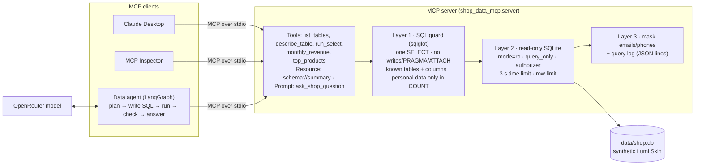
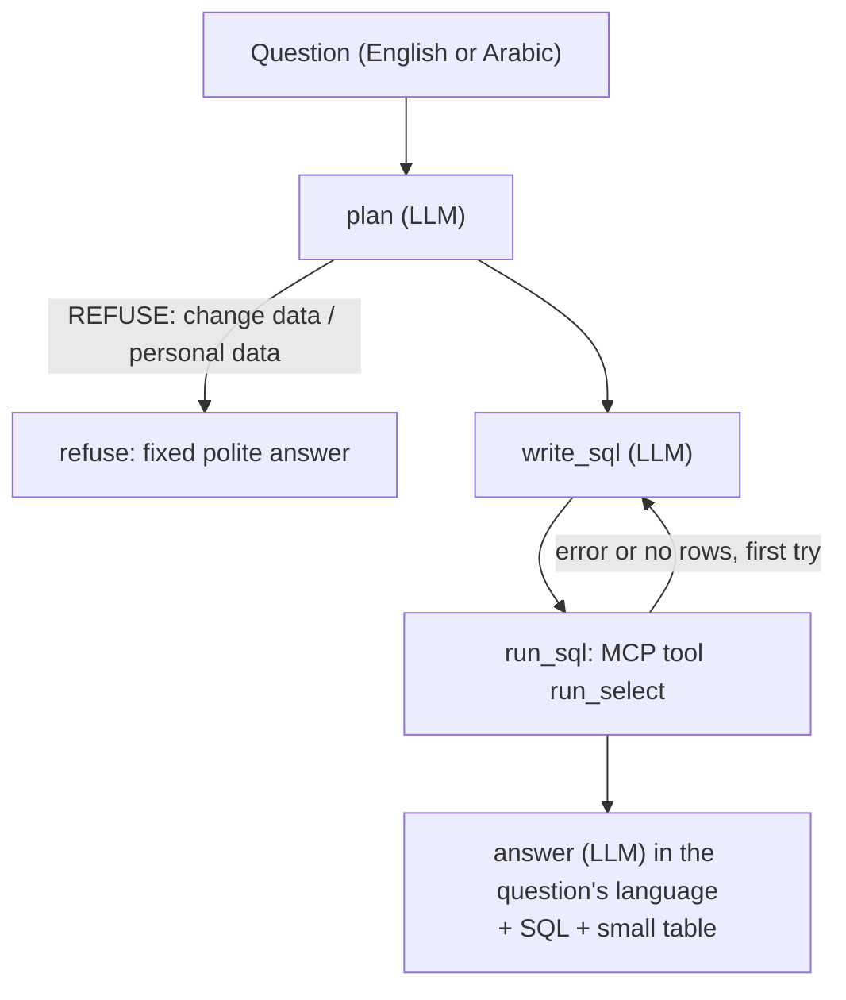

# Architecture

## Components

| File | Job |
|---|---|
| `src/shop_data_mcp/config.py` | Paths, limits, the schema with column meanings, the personal columns and the business rules. One source of truth. |
| `src/shop_data_mcp/guard.py` | Layer 1. Parses SQL with sqlglot and applies 8 rules before anything reaches the database. |
| `src/shop_data_mcp/db.py` | Layers 2 and 3. Read-only connection, SQLite authorizer, time and row limits, masking. |
| `src/shop_data_mcp/tools.py` | The tool logic in plain Python (testable without MCP); logs every query. |
| `src/shop_data_mcp/server.py` | Thin MCP wrapper (official SDK, `MCPServer`, called `FastMCP` in SDK v1). |
| `src/shop_data_mcp/mcp_client.py` | How the agent connects to the server (stdio subprocess, or in-process for tests). |
| `src/shop_data_mcp/agent.py` | LangGraph graph: plan, write SQL, run it via MCP, retry once, answer in the user's language. |
| `src/shop_data_mcp/llm.py` | The only module that calls a model (OpenRouter); `FakeLLM` for tests and dry runs; traces. |
| `src/shop_data_mcp/generate_data.py` | Builds `data/shop.db` (seed 42). |
| `evals/` | 50 questions + gold answers, 15 unsafe prompts, scoring, guard evaluation, agent evaluation. |
| `app/app.py` | Gradio demo: chat with "show SQL", and a "Try the guard" tab that needs no key. |

## Why three layers

The guard is the precise layer: it understands SQL, so it can say *why* a query is refused and
the model can fix it. But parsers can have gaps, so the database connection is independently
unable to write (layer 2), and the output is scanned for emails and phone numbers (layer 3).
`evals/run_guard.py` measures each layer on its own: with the guard switched off, the read-only
connection still stopped every write and admin attempt, but 4 personal-data queries leaked names
or addresses, which is exactly what the guard's personal-data rule is for.

## Data agent flow

